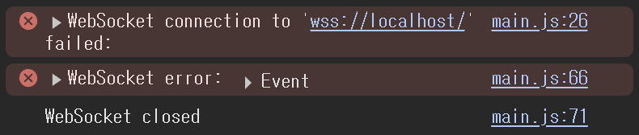

# NeungPOP
## 1. 소개
본 프로젝트는 [팝캣](https://popcat.click/)의 능주고 버전으로 팝캣 카피 사이트입니다. 본 프로젝트의 목적은 팝캣을 능주고 버전으로 만들고, 반에 따라 공격과 방어를 할 수 있는 시스템을 마련함으로서 신박한 반별 대항전을 펼칠 수 있도록 함에 의의를 두고 개발되었습니다.

## 2. 설치 및 설정
### 2-1. 설치 및 실행
기본적으로 node.js를 사용하기 때문에 다음과 같은 명령어로 프로젝트에 필요한 모듈들을 설치해주세요
```bash
npm install
```
그 후 모듈 설치가 완료되면 다음과 같은 명령어로 앱을 실행할 수 있습니다.
```bash
node app.js
```
### 2-2. 설정
앱을 실행하기 전에 `.env`파일을 생성하여 환경변수를 설정해주세요. 클라이언트에서 DB에 접근할때 사용하는 비밀번호입니다.
```env
PW=SET_YOUR_PASSWORD
```
## 3. 클라이언트에서 DB초기화 하기
클라이언트 콘솔창에서 사용할 수 있는 명령어는 다음과 같습니다. pw는 env파일에서 설정한 pw입니다.

- `resetDB({pw, id(선택), date(선택)})`: DB를 초기화 합니다. date와 id를 입력하여 특정 시간에 초기화 하도록 예약할 수 있습니다.
- `cancelSchedule({pw, id})`: 특정 id를 가진 초기화 예약스케줄을 취소합니다.
- `getResetSchedule()`: 현재 예약된 모든 초기화 스케줄을 가져옵니다.
## 4. 발생할 수 있는 문제
앱을 로컬로 실행시킬때 웹소켓 연결에 실패하는 경우

[main.js](public/javascripts/main.js#L25-L27)의 25-27번줄을
```js
// 클라이언트에서 웹소켓 연결 시도
//const socket = new WebSocket('wss://' + window.location.hostname);
const socket = new WebSocket('ws://localhost:8080');
```
다음과 같이 바꿔 localhost:8080으로 바꿔주세요.
## 5. 참고 자료
다음은 참고하면 좋은 문서들입니다. 기본적인 패키지들을 숙지하여 주세요.

[dayjs](https://day.js.org/docs/en/installation/installation), [node-schedule](https://www.npmjs.com/package/node-schedule), [better-sqlite3](https://www.npmjs.com/package/better-sqlite3)
## 6. 개발자
- [@charlie-1126](https://github.com/charlie-1126)
- [@bmcyver](https://github.com/bmcyver)